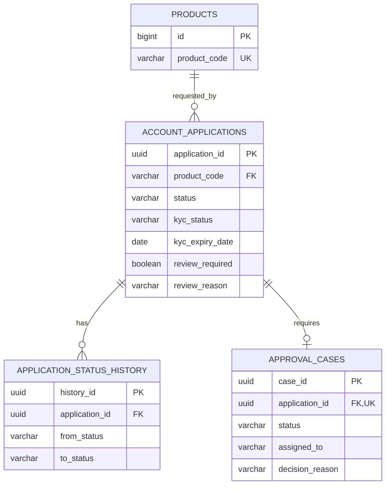

# Data Design

## 1. Data Model Overview và ERD

## 2. Entity / Table Definitions

| Table | Definition |
|---|---|
| `products` | Identity ID, unique code, product fields/flags/timestamps; `min_age >= 0`. |
| `account_applications` | UUID ID, customer/product/status, KYC snapshot, `review_required/review_reason`, rejection/submission/cancellation/timestamps. |
| `application_status_history` | UUID ID, application FK, from/to status, actor, reason, time. |
| `approval_cases` | UUID ID, unique application FK, case status, assignment/review/decision data và timestamps. |

## 3. Relationships, Keys, Constraints, Indexes

`account_applications.product_code` references `products(product_code)`. V7 thêm CHECK constraint: true phải có reason, false phải không có reason; null/null được giữ để nhận diện row cũ chưa refresh snapshot. History references application with `ON DELETE CASCADE`. `approval_cases.application_id` references application và UNIQUE. Approval indexes cover status, assigned staff và created time.

## 4. Data Lifecycle Notes

Flyway V1–V7/JPA là source of truth; V6 tạo ApprovalCase, V7 thêm manual-review snapshot. Hibernate chỉ validate schema. `integration_requests`, `bank_accounts`, `notifications`, `audit_logs` là PLANNED.
