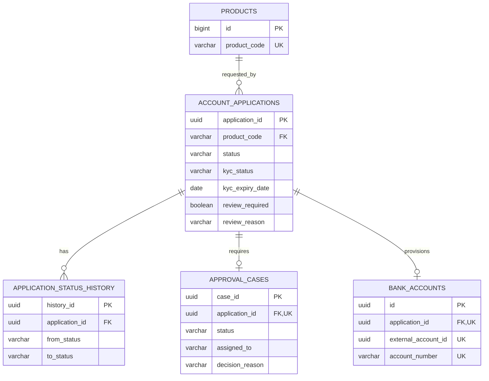

# Data Design

## 1. Data Model Overview và ERD

## 2. Entity / Table Definitions

| Table | Definition |
|---|---|
| `products` | Identity ID, unique code, product fields/flags/timestamps; `min_age >= 0`. |
| `account_applications` | UUID ID, customer/product/status, KYC snapshot, `review_required/review_reason`, rejection/submission/cancellation/timestamps. |
| `application_status_history` | UUID ID, application FK, from/to status, actor, reason, time. |
| `approval_cases` | UUID ID, unique application FK, case status, assignment/review/decision data và timestamps. |
| `bank_accounts` | Local projection: unique application/external account/account number, status và opened time. |

## 3. Relationships, Keys, Constraints, Indexes

`bank_accounts.application_id` references application và UNIQUE. `external_account_id` và `account_number` cũng UNIQUE. Main không lưu balance, transaction hoặc ledger.

## 4. Data Lifecycle Notes

Flyway V1–V8/JPA là source of truth; V8 tạo local `bank_accounts`. Core Banking Mock có database riêng và là owner của account domain. `integration_requests`, `notifications`, `audit_logs` vẫn PLANNED.
