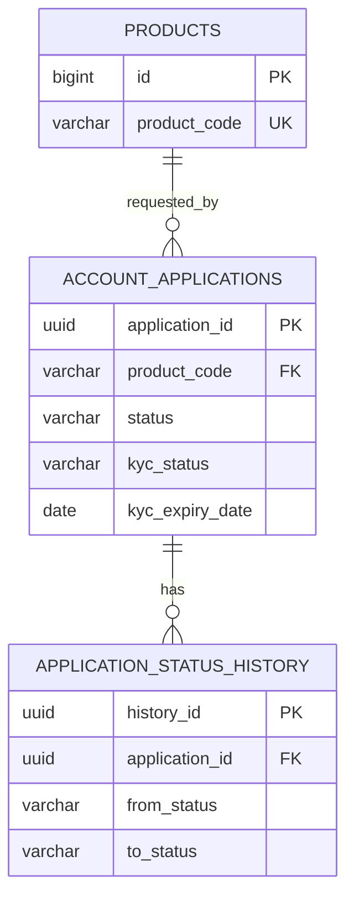

# Data Design

## 1. Data Model Overview và ERD

## 2. Entity / Table Definitions

| Table | Definition |
|---|---|
| `products` | Identity ID, unique code, product fields/flags/timestamps; `min_age >= 0`. |
| `account_applications` | UUID ID, customer/product/status, KYC snapshot, rejection/submission/cancellation/timestamps. |
| `application_status_history` | UUID ID, application FK, from/to status, actor, reason, time. |

## 3. Relationships, Keys, Constraints, Indexes

`account_applications.product_code` references `products(product_code)`. History references application with `ON DELETE CASCADE`. Application indexes cover customer, product, status, created time; history indexes cover application/time and target status. No local customers table, ownership table, or customer/product uniqueness constraint exists.

## 4. Data Lifecycle Notes

Flyway V1–V5/JPA are source of truth; Hibernate validates schema only. `approval_cases`, `integration_requests`, `bank_accounts`, `notifications`, `audit_logs` are PLANNED tables.
