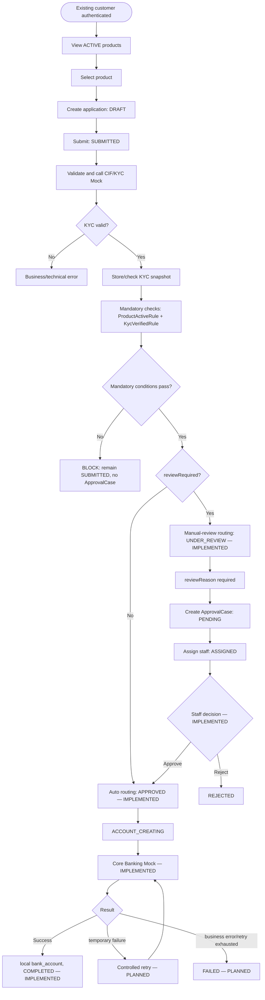
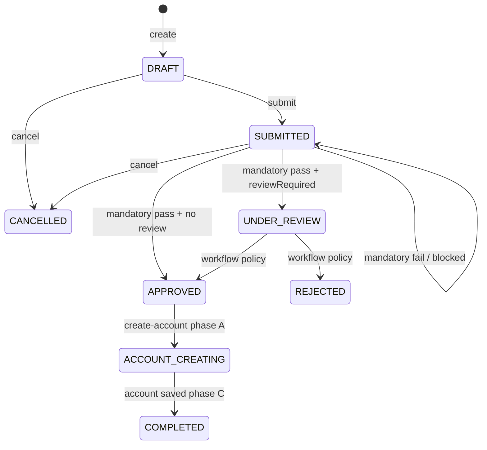

# Workflow Design

## 1. Workflow Overview và Preconditions

Customer là existing customer, đã authenticated và có CIF. Authentication/login và tạo CIF mới không thuộc scope.

## 2. BPMN — End-to-End Business Process

## 3. Application Lifecycle và State Machine

`ApplicationWorkflowService` also enforces `APPROVED → ACCOUNT_CREATING → COMPLETED`. `COMPLETED` is terminal. Technical Core Banking failure leaves the application at `ACCOUNT_CREATING`.

## 4. Allowed State Transitions

Current public operations: create DRAFT, DRAFT→SUBMITTED, DRAFT/SUBMITTED→CANCELLED. Process giữ `SUBMITTED` khi mandatory condition fail; chuyển APPROVED khi mandatory pass và không cần review; chuyển UNDER_REVIEW khi mandatory pass và `reviewRequired=true`. Invalid workflow transitions return `INVALID_APPLICATION_STATUS_TRANSITION`.

## 5. Business Rules

| Rule | Status | Pass condition | Fail |
|---|---|---|---|
| `PRODUCT_ACTIVE` | IMPLEMENTED | Product exists and active. | Inactive/null; missing product is exception. |
| `KYC_VERIFIED` | IMPLEMENTED | VERIFIED, timestamp/expiry exist and expiry current. | Missing/invalid/expired snapshot. |

`eligible` của rule evaluation chỉ có nghĩa mandatory conditions đã thỏa mãn. Nó không còn quyết định manual review. Future enhancements: duplicate product needs ownership data; age needs verified DOB; advanced customer/risk rules cần approved inputs/policy.

## 6. Rule Evaluation Outcomes

Current evaluate endpoint only returns eligibility and remains read-only.

IMPLEMENTED:

- Mandatory rule failure → BLOCK, giữ `SUBMITTED`, không tạo ApprovalCase.
- Mandatory pass + `reviewRequired=false` → `APPROVED`.
- Mandatory pass + `reviewRequired=true` và reason hợp lệ → `UNDER_REVIEW` và tạo ApprovalCase.

Staff approval is IMPLEMENTED: routing to `UNDER_REVIEW` creates one `PENDING` case; assignment moves it to `ASSIGNED`; only assigned staff may approve/reject. Approve reevaluates mandatory rules, nhưng không yêu cầu `reviewRequired=false` vì review signal là lý do case tồn tại. Case và application transition hoàn tất trong một transaction.

Account provisioning is a separate operation. Phase A commits `ACCOUNT_CREATING`, phase B calls Core Banking without a database transaction, and phase C atomically stores the local reference and transitions to `COMPLETED`.

## 7. Exception Overview, Audit and Status History

Business KYC failures do not persist a success snapshot. Technical CIF/KYC failures return 503 and are not customer rejection. `ApplicationStatusHistory` is currently written for create, submit, cancel, and process transitions. AuditLog is PLANNED; history/audit are cross-cutting business-event concerns, not end-of-flow tasks.
