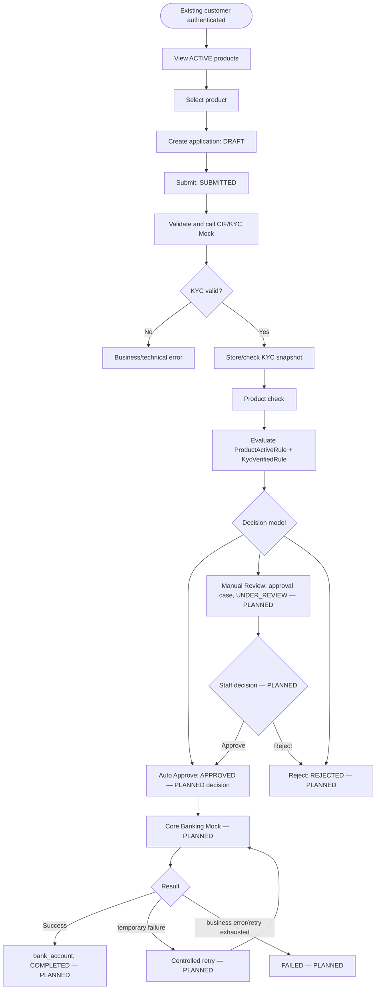
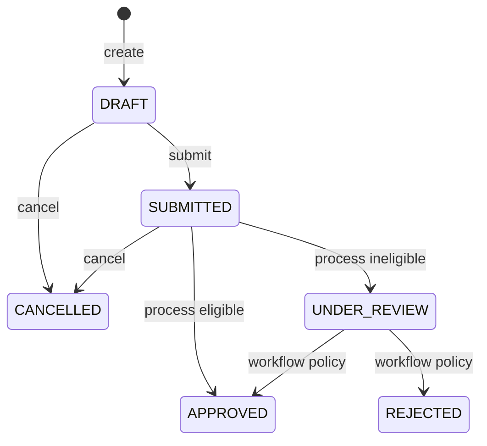

# Workflow Design

## 1. Workflow Overview và Preconditions

Customer là existing customer, đã authenticated và có CIF. Authentication/login và tạo CIF mới không thuộc scope.

## 2. BPMN — End-to-End Business Process

## 3. Application Lifecycle và State Machine

`ApplicationWorkflowService` enforces the diagram transitions. Current public process reaches APPROVED/UNDER_REVIEW; staff operations for UNDER_REVIEW approval/rejection are not exposed. FAILED has no current flow.

## 4. Allowed State Transitions

Current public operations: create DRAFT, DRAFT→SUBMITTED, DRAFT/SUBMITTED→CANCELLED, SUBMITTED→APPROVED when eligible, SUBMITTED→UNDER_REVIEW when ineligible. Invalid workflow transitions return `INVALID_APPLICATION_STATUS_TRANSITION`.

## 5. Business Rules

| Rule | Status | Pass condition | Fail |
|---|---|---|---|
| `PRODUCT_ACTIVE` | IMPLEMENTED | Product exists and active. | Inactive/null; missing product is exception. |
| `KYC_VERIFIED` | IMPLEMENTED | VERIFIED, timestamp/expiry exist and expiry current. | Missing/invalid/expired snapshot. |

Future enhancements: duplicate product needs ownership data; age needs verified DOB; customer active/risk/required data/manual review need approved inputs/policy.

## 6. Rule Evaluation Outcomes

Current evaluate endpoint only returns eligibility. Auto approve/manual review from `processApplication` are implemented for eligible/ineligible results; direct reject and approval case are PLANNED.

## 7. Exception Overview, Audit and Status History

Business KYC failures do not persist a success snapshot. Technical CIF/KYC failures return 503 and are not customer rejection. `ApplicationStatusHistory` is currently written for create, submit, cancel, and process transitions. AuditLog is PLANNED; history/audit are cross-cutting business-event concerns, not end-of-flow tasks.
